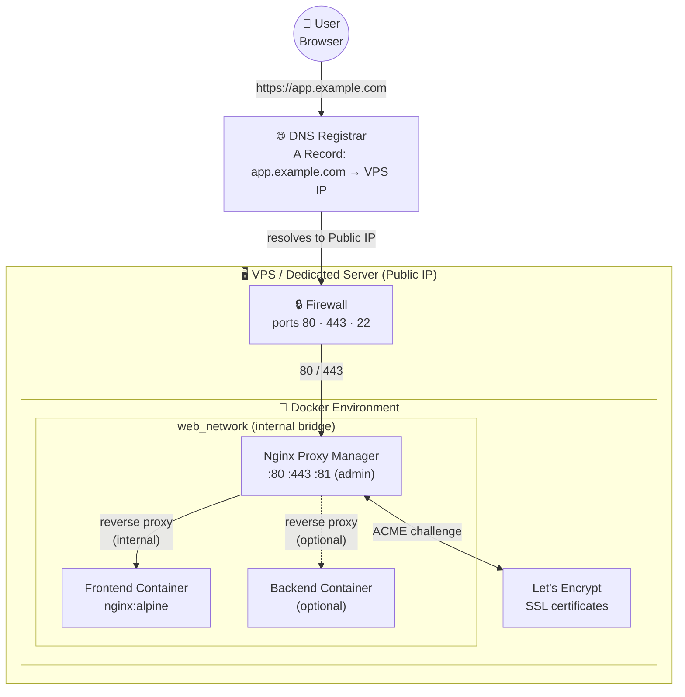
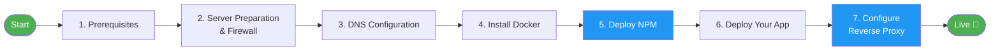
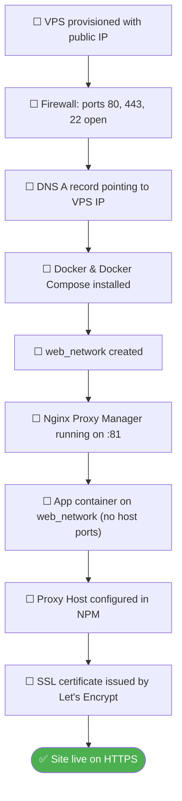

# Web Server Deployment Guide

This guide explains how to deploy a web application starting from a fresh Virtual Private Server (VPS) or a dedicated server with a public IP. We will use Docker and Nginx Proxy Manager (NPM) to expose services securely.

## Global Architecture

The diagram below shows the full picture of what you are building. Every section in this guide maps to one of these layers.

## Deployment Steps Overview

## Deployment Checklist

