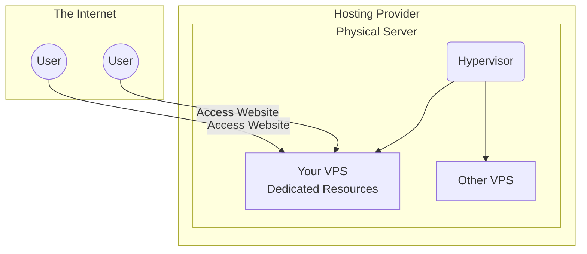

# 1. Prerequisites

Before deploying, you need the foundational infrastructure.

## What is a VPS or Dedicated Server?
When deploying a web application, you need a computer that is always on and connected to the internet. 

- **VPS (Virtual Private Server):** A virtual machine sold as a service. It shares physical hardware with other instances but acts as a dedicated server.
- **Dedicated Server:** A single physical computer reserved entirely for you.

## Checklist
- A **VPS or Dedicated Server** with a public IP address.
- **Root or Sudo Access** to the server.
- A **Domain Name** (e.g., `example.com`).
