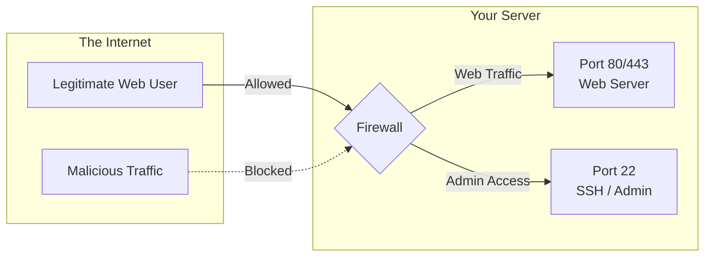

# 2. Server Preparation & Firewalls

When you run a server, it's connected to the vast internet. To keep it secure, we use firewalls and ports.

## Understanding Firewalls and Ports
Think of your server as a large office building and its IP address as the building's street address. **Ports** are like the individual doors. A **Firewall** is the security guard deciding which doors are allowed to be opened from the outside.



## Firewall Configuration

Your server must have the following ports open and accessible from the internet:
- **Port 80 (HTTP):** Initial traffic & Let's Encrypt SSL generation.
- **Port 443 (HTTPS):** Secure web traffic.
- **Port 22 (SSH):** Server administration.

If you are using `ufw` (Ubuntu/Debian):
```bash
sudo ufw allow 80/tcp
sudo ufw allow 443/tcp
sudo ufw allow 22/tcp
sudo ufw enable
```

> **Note:** If your cloud provider has an **external firewall** (e.g., AWS Security Groups), open ports 80 and 443 in their dashboard as well.
