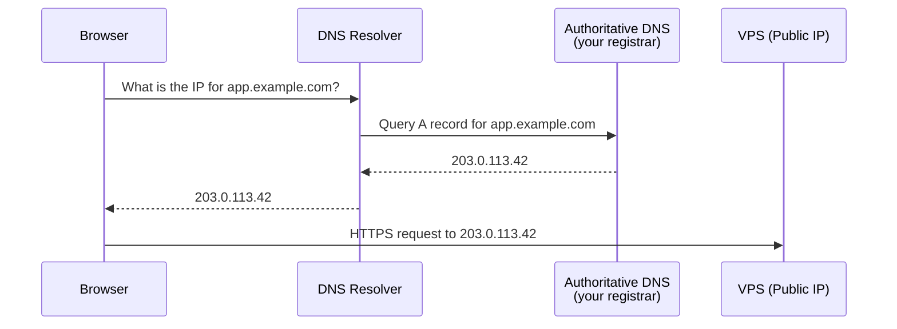

# 3. DNS Configuration

**DNS (Domain Name System)** is the phonebook of the internet. It translates domain names (like `example.com`) to IP addresses.

## How DNS Resolution Works

## Setup Steps

1. Go to your domain registrar's DNS settings.
2. Create an **A Record**.
3. Set the **Host/Name** to `@` (root domain) or a subdomain (e.g., `app`).
4. Set the **Value/Points To** to your server's **public IP address**.
5. *(Optional)* Create a wildcard record (`*`) or CNAME records for other subdomains pointing to the same A record.

> DNS propagation can take anywhere from a few minutes to up to **48 hours**.
