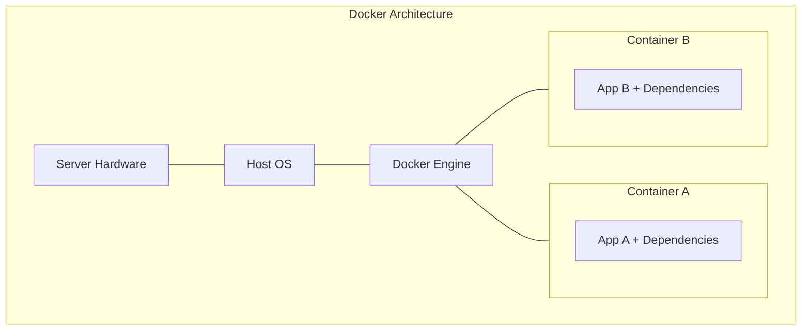

# 4. Install Docker and Docker Compose

Docker containers bundle your application and all its dependencies into a single, standard unit that can run anywhere. Docker Compose lets you define multi-container applications using a YAML file.

## Docker Architecture



## Installation Steps

Run the following commands on your server to install Docker:

```bash
curl -fsSL https://get.docker.com -o get-docker.sh
sudo sh get-docker.sh
```

Docker Compose is included in modern Docker installations as `docker compose` (no hyphen).
