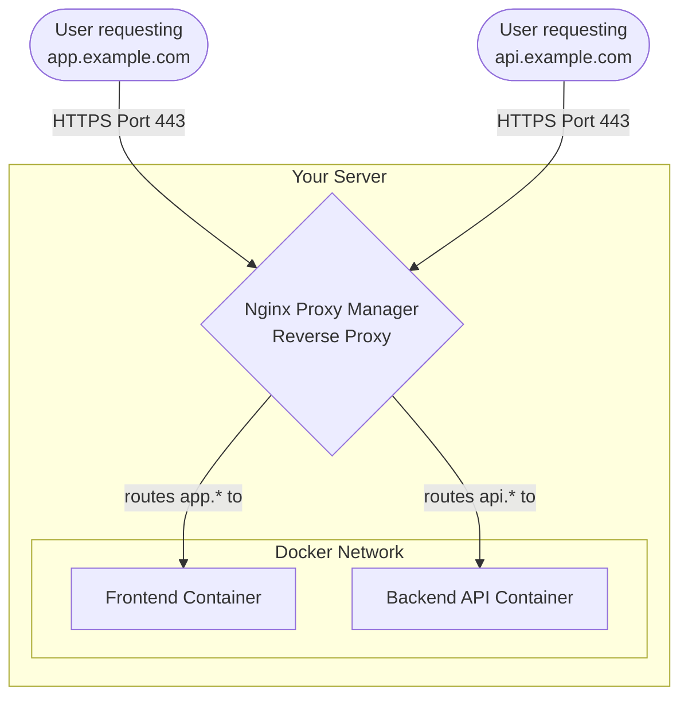

# 5. Deploy Nginx Proxy Manager

A **Reverse Proxy** sits in front of web servers and forwards client requests to them. **Nginx Proxy Manager (NPM)** provides a web UI to configure an Nginx reverse proxy and manage SSL certificates effortlessly.

## What NPM Does



## Setup Steps

1. Create a directory for Nginx Proxy Manager:
```bash
mkdir -p /opt/npm
cd /opt/npm
```

2. Create a `docker-compose.yml` file:
```yaml
version: '3.8'
services:
  app:
    image: 'jc21/nginx-proxy-manager:latest'
    restart: unless-stopped
    ports:
      - '80:80'   # Public HTTP
      - '443:443' # Public HTTPS
      - '81:81'   # Admin UI
    volumes:
      - ./data:/data
      - ./letsencrypt:/etc/letsencrypt
```

3. Start the service:
```bash
docker compose up -d
```

4. Access the admin interface at `http://<your-server-ip>:81`.
   - Default Email: `admin@example.com`
   - Default Password: `changeme`
   - You will be prompted to change these on first login.
