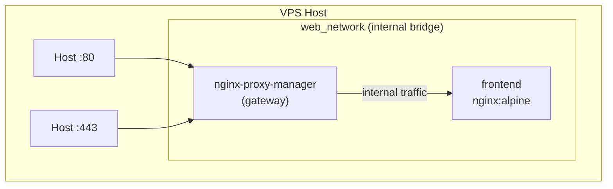

# 6. Deploy Your Application

We will connect your application to NPM using an internal Docker network, ensuring no application ports are directly exposed to the internet.

## Docker Network Topology



## Steps

1. Create the shared Docker network:
```bash
docker network create web_network
```

2. Update NPM's `docker-compose.yml` (`/opt/npm/docker-compose.yml`) to join this network:
```yaml
version: '3.8'
services:
  app:
    image: 'jc21/nginx-proxy-manager:latest'
    restart: unless-stopped
    ports:
      - '80:80'
      - '443:443'
      - '81:81'
    volumes:
      - ./data:/data
      - ./letsencrypt:/etc/letsencrypt
    networks:
      - web_network

networks:
  web_network:
    external: true
```

Restart NPM: `cd /opt/npm && docker compose down && docker compose up -d`

3. Create a directory for your app:
```bash
mkdir -p /opt/my-frontend
cd /opt/my-frontend
```

4. Create a `docker-compose.yml` for your frontend:
```yaml
version: '3.8'
services:
  frontend:
    image: nginx:alpine
    restart: unless-stopped
    volumes:
      - ./html:/usr/share/nginx/html
    networks:
      - web_network

networks:
  web_network:
    external: true
```

5. Start your frontend:
```bash
docker compose up -d
```
