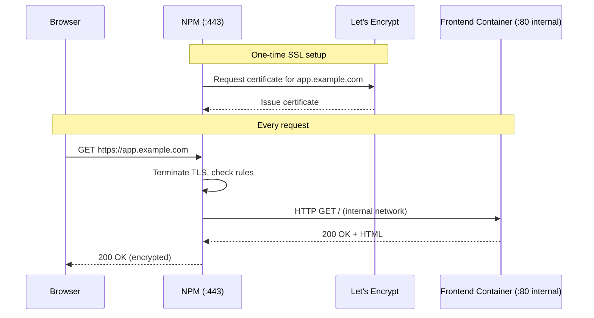

# 7. Configure Reverse Proxy & SSL

**SSL/TLS** encrypts the data between your browser and the server. **Let's Encrypt** provides free SSL certificates. NPM automates fetching and renewing these certificates.

## HTTPS Request Flow

## Steps in NPM Admin UI

1. Open the NPM admin UI at `http://<your-server-ip>:81`.
2. Go to **Hosts** → **Proxy Hosts** and click **Add Proxy Host**.
3. **Details** tab:
   - **Domain Names:** `app.example.com`
   - **Scheme:** `http`
   - **Forward Hostname / IP:** `frontend` *(the service name from your docker-compose)*
   - **Forward Port:** `80`
   - Enable **Block Common Exploits** and **Websockets Support**.
4. **SSL** tab:
   - Select **Request a new SSL Certificate**.
   - Enable **Force SSL**, **HTTP/2 Support**, and **HSTS Enabled**.
   - Enter your email and agree to the Let's Encrypt Terms of Service.
5. Click **Save**.

NPM will fetch the SSL certificate and securely route traffic from `https://app.example.com` to your frontend container. Your deployment is now complete and secure!
