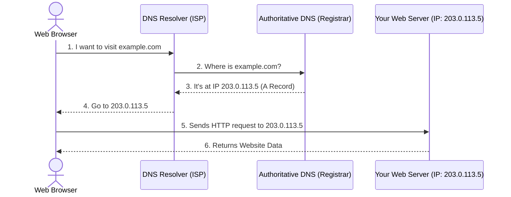

# How DNS Works

**DNS (Domain Name System)** is the phonebook of the internet. 

Humans access information online through domain names, like `example.com`. Web browsers interact through Internet Protocol (IP) addresses (like `192.168.1.1`). DNS translates domain names to IP addresses so browsers can load internet resources.

## Common DNS Records

- **A Record:** Points a domain (e.g., `example.com`) to an IPv4 address.
- **CNAME Record:** Points a domain to another domain name (like an alias).
- **Wildcard Record (`*`):** A record that will match requests for non-existent subdomains. For example, `*.example.com` would route `app.example.com` and `blog.example.com` to the same place.

## Concept Visualization

When you configure your DNS to point to your VPS, you are setting up the "Authoritative DNS" to tell the world which IP address belongs to your domain name.
