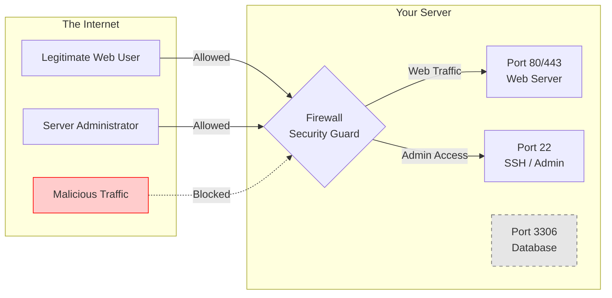

# Understanding Firewalls and Ports

When you run a server, it's connected to the vast internet. To keep it secure, we use firewalls and ports.

## What is a Port?
Think of your server as a large office building and its IP address as the building's street address. **Ports** are like the individual doors or room numbers in that building. Different services use different ports:
- **Port 80:** The standard door for unencrypted web traffic (HTTP).
- **Port 443:** The secure door for encrypted web traffic (HTTPS).
- **Port 22:** The employee entrance for server administrators (SSH).

## What is a Firewall?
A **Firewall** is the security guard at the front desk of your office building. It decides which doors (ports) are allowed to be opened from the outside and who is allowed to enter.

## Concept Visualization

In the diagram above, the firewall blocks malicious traffic but allows web users to access the web server ports (80/443) and administrators to access the SSH port (22). The database port (3306) is hidden behind the firewall and not accessible from the outside internet.
