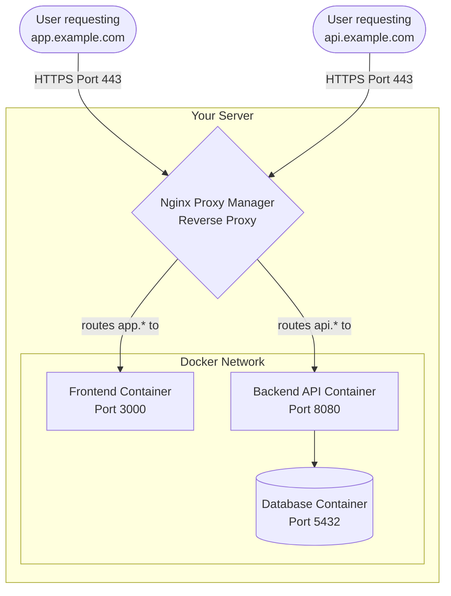

# Nginx Proxy Manager & Reverse Proxies

## What is a Reverse Proxy?
A **Reverse Proxy** is a server that sits in front of web servers and forwards client (e.g., web browser) requests to those web servers.

Imagine a large restaurant. When you arrive, you don't go straight to the kitchen to talk to a chef. You talk to the **Maître D'** (the reverse proxy). The Maître D' takes your order, decides which chef is best suited to cook it, takes the food from the chef, and hands it back to you. The kitchen is hidden from the customer.

## What is Nginx Proxy Manager (NPM)?
Nginx Proxy Manager is a user-friendly web interface that configures an Nginx reverse proxy under the hood. It makes it incredibly easy to:
- Route `api.example.com` to one Docker container and `app.example.com` to another.
- Easily acquire and manage Free SSL Certificates from Let's Encrypt.
- Manage access and security.

## Concept Visualization

The reverse proxy handles all incoming traffic on the standard HTTP/HTTPS ports (80/443) and intelligently routes it to the correct internal container on the internal Docker network. The internal containers don't need their ports exposed to the public internet.
