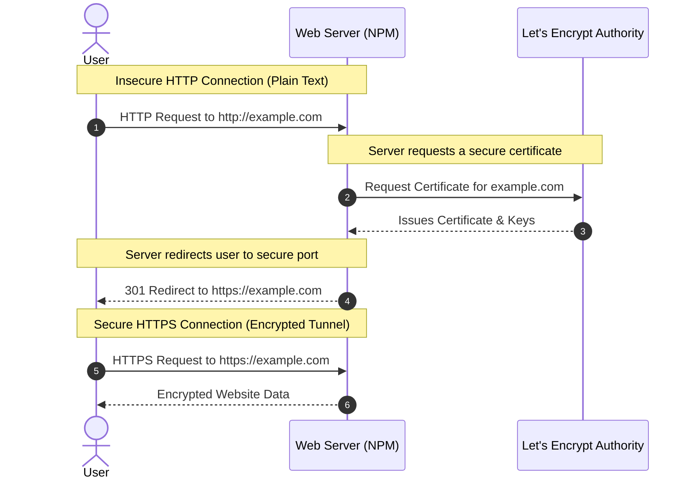

# SSL Certificates and Let's Encrypt

## What is SSL/TLS?
**SSL (Secure Sockets Layer)** and its modern successor **TLS (Transport Layer Security)** are cryptographic protocols designed to provide communications security over a computer network. 

When a website uses SSL, the URL starts with **HTTPS** (Hypertext Transfer Protocol Secure) instead of HTTP, and a padlock icon appears in the browser. This means the data passed between your browser and the web server is encrypted, protecting sensitive information like passwords and credit card numbers from eavesdroppers.

## What is Let's Encrypt?
**Let's Encrypt** is a free, automated, and open certificate authority (CA). It provides free SSL/TLS certificates to enable encrypted HTTPS on web servers. Nginx Proxy Manager integrates directly with Let's Encrypt to automatically fetch and renew these certificates.

## Concept Visualization

By using HTTPS, even if someone intercepts the traffic between the user and the server, they will only see unreadable, encrypted gibberish.
