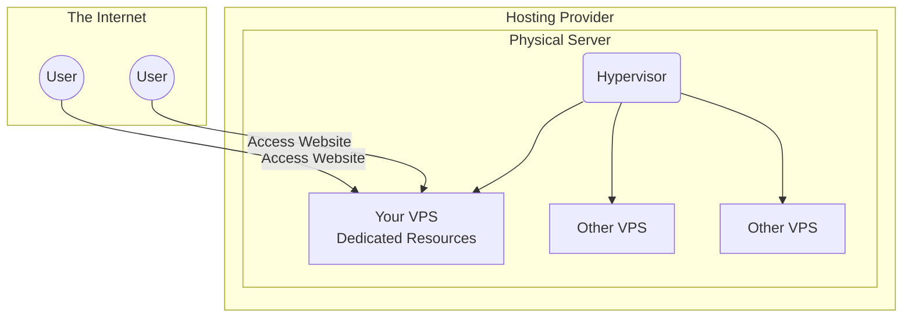

# What is a VPS or Dedicated Server?

When deploying a web application, you need a computer that is always on and connected to the internet. 

## VPS (Virtual Private Server)
A VPS is a virtual machine sold as a service by an Internet hosting service. It runs its own copy of an operating system, and you have superuser-level access to that operating system instance. It shares physical hardware with other VPS instances but acts as a dedicated server.

## Dedicated Server
A dedicated server is a single physical computer in a network reserved for serving the needs of the network. You do not share the physical resources (CPU, RAM, storage) with any other users.

## Concept Visualization

In simpler terms, think of a Dedicated Server as owning a whole house, while a VPS is like renting a private apartment within a larger building. You have your own space and locks, but you share the underlying building infrastructure.
